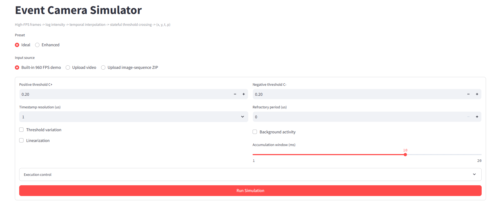
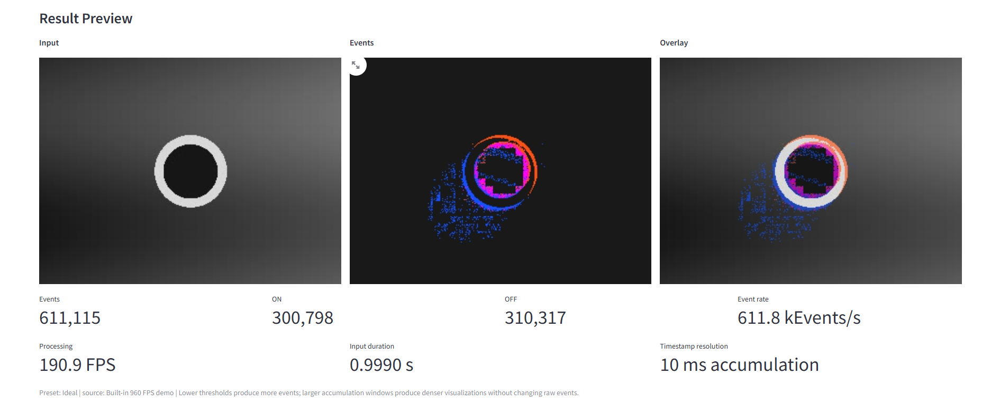
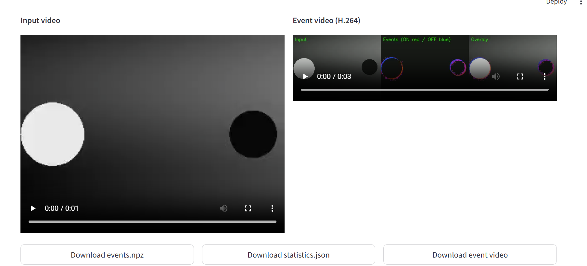

# Python Event Camera Simulator (`evsim`)

[](https://share.streamlit.io/deploy?repository=https%3A%2F%2Fgithub.com%2FYDxun%2FEvent-Camera-Simulator&branch=main&mainModule=app.py)

A configurable, explainable and verifiable event-camera simulator written in Python.
It converts high-FPS grayscale/video frames into asynchronous event streams
`(x, y, t, p)` using the log-intensity contrast-threshold model.

The project deliberately focuses on the CA requirement:

```text
High-FPS frames + sensor parameters
               |
               v
          Event simulator
               |
               v
      raw events + illustrative video
```

It does not perform edge detection or downstream tasks such as tracking, SLAM or detection.

## Features

- Video input via OpenCV: MP4, AVI, MOV and other installed codecs.
- Image-sequence input with natural sorting and optional `ts_frame.txt`.
- Automatic FPS handling and fallback FPS for image sequences.
- Optional gamma-to-linear-light conversion before log intensity.
- Logarithmic intensity `L = log(I + epsilon)`.
- Separate positive and negative thresholds `C+`, `C-`.
- Pixel reference state `L_ref`, updated only when an event fires.
- Multiple threshold crossings inside one frame interval.
- Linear interpolation of event timestamps and configurable timestamp resolution.
- Pixel-wise Gaussian threshold variation.
- Simple background activity / leak-event model.
- Configurable refractory period.
- NumPy vectorized event generation and an independent pixel-loop reference backend.
- Event output to CSV and compressed NPZ.
- Accumulated event frames, overlay and three-panel illustrative video.
- Built-in analytic validation, backend equivalence checks and benchmarks.

## Architecture

```text
Video / image sequence
        |
        v
FrameSource -> grayscale -> optional linearization -> log intensity
        |
        v
Temporal model: linear interpolation between L(t0) and L(t1)
        |
        v
Pixel state:
  L_ref, C+(x,y), C-(x,y), last_event_time
        |
        +--> ON event when  L - L_ref >= C+
        +--> OFF event when L - L_ref <= -C-
        |
        v
Pixel-array backend (vectorized or pixel-loop)
        |
        +--> CSV / NPZ event stream
        +--> statistics
        +--> event accumulation video
```

## Event model

For each pixel and frame interval `[t0, t1]`:

```text
L0 = log(I0 + epsilon)
L1 = log(I1 + epsilon)
Delta L(t) = L(t) - L_ref
```

Linear interpolation assumes:

```text
L(t) = L0 + (t - t0) / (t1 - t0) * (L1 - L0)
```

A positive threshold crossing at level `L_e = L_ref + C+` occurs at:

```text
t_e = t0 + (L_e - L0) / (L1 - L0) * (t1 - t0)
```

The same equation with `L_e = L_ref - C-` is used for OFF events.
After each accepted event the pixel reference is reset:

```text
ON:  L_ref <- L_ref + C+
OFF: L_ref <- L_ref - C-
```

When the change is larger than several thresholds, several events are generated
between the two input frames. The number is calculated with:

```text
N_plus  = floor(max(L1 - L_ref, 0) / C_plus)
N_minus = floor(max(L_ref - L1, 0) / C_minus)
N = N_plus + N_minus
```

Refractory suppression rejects an event if:

```text
t_event - t_last_event < refractory_period
```

## Install

The project targets Python 3.10+.

```bash
python -m pip install -e .
```

The main dependencies are NumPy, OpenCV and tqdm. Pytest and Matplotlib are
installed through the `dev` extra:

```bash
python -m pip install -e ".[dev]"
```

## Quick start

Run the analytic and cross-backend validation:

```bash
python -m evsim validate --output-json results_python/validation.json
```

Create and process a self-contained 960 FPS demo:

```bash
python -m evsim demo --output-dir results_python/demo --fps 960 --seconds 1
```

Simulate an external video:

```bash
python -m evsim simulate \
  --input path/to/high_fps_video.mp4 \
  --config configs/realistic.json \
  --output-csv results_python/events.csv \
  --output-npz results_python/events.npz \
  --video results_python/events.avi
```

Inspect an input without running simulation:

```bash
python -m evsim inspect --input path/to/video_or_sequence
```


The analytical checks verify consistency with the implemented mathematical
model. They are not a validation against a physical event-camera sensor.

## Configuration

Two ready-to-use configurations are included:

- `configs/ideal.json`: deterministic model, no noise, no refractory period.
- `configs/realistic.json`: enhanced non-ideal model with asymmetric thresholds,
  threshold variation, background activity, linearization and refractory period.

Important parameters:

| Parameter | Meaning |
|---|---|
| `input.fallback_fps` | FPS used when timestamps are absent |
| `input.linearize` | Apply inverse gamma before log intensity |
| `sensor.positive_threshold` | `C+` |
| `sensor.negative_threshold` | `C-` |
| `sensor.log_epsilon` | Stabilizes `log(0)` |
| `sensor.timestamp_resolution_us` | Timestamp quantization step |
| `sensor.refractory_period_us` | Minimum time between events at one pixel |
| `noise.threshold_sigma` | Standard deviation of pixel threshold mismatch |
| `noise.background_rate_hz` | Expected spontaneous events per pixel per second |
| `visualization.accumulation_time_us` | Event accumulation window only; it does not change raw events |

## Output formats

CSV columns:

```text
timestamp_s,x,y,polarity
```

NPZ contains a structured NumPy array named `events` with fields:

```text
timestamp_us, x, y, polarity
```

The statistics JSON contains event count, ON/OFF counts, event rate, timestamp
range, monotonicity and processing throughput.

## Validation

Run all unit tests:

```bash
python -m pytest -q
```

Run all reproducible course experiments:

```bash
python scripts/run_experiments.py
```

This produces:

- analytic timestamp and asymmetric-threshold checks,
- threshold sweep and `N ~ 1/C` normalization,
- FPS convergence experiment,
- four-level simplified sensor non-ideality ablation,
- accumulated representation comparison at 1/5/10/20 ms,
- direct-log versus gamma-linearized preprocessing,
- vectorized versus pixel-loop benchmark,
- generated final report in `results_python/REPORT.md`.

## Assumptions and limitations

- Input motion must already be captured by the high-FPS source; the simulator
  cannot recover information destroyed by motion blur or temporal aliasing.
- Interpolation is linear inside each frame interval.
- Readout arbitration and transistor-level pixel circuitry are outside scope.
- Background activity is a simple Poisson/Bernoulli approximation.
- The source video is gamma encoded by default; linearization can be enabled
  but the actual camera response curve is generally unknown.

## Timestamp and refractory conventions

Event timestamps use floor quantization:

```text
t_q = floor(t_e / Delta t_q) * Delta t_q
```

This is intentionally floor quantization, not nearest rounding. Therefore two
events may share the same quantized timestamp. The event-stream contract is
non-decreasing time:

```text
t_(i+1) >= t_i
```

not strictly increasing time. Refractory suppression is applied after
quantization:

```text
continuous crossing time -> floor quantization -> refractory check
```

Consequently, the refractory model operates on quantized output timestamps.

Event statistics report two rates:

- `event_rate_over_active_hz = N / (t_last_event - t_first_event)`
- `event_rate_over_input_hz = N / input_duration`

The legacy `event_rate_hz` field is retained as an alias of the active-duration
rate. New analysis should use the explicit fields.

## Modelling assumptions

- `A1`: Log intensity is piecewise linear between consecutive input frames.
- `A2`: Pixels generate events independently.
- `A3`: Events are triggered by the contrast-threshold model `Delta L = +/- C`.
- `A4`: Threshold mismatch is a fixed per-pixel Gaussian offset.
- `A5`: Background activity is a simplified Poisson process.
- `A6`: Readout arbitration and transistor-level circuitry are not simulated.
- `A7`: Information already lost in the source video, such as motion blur,
  temporal aliasing or saturation, cannot be recovered.

## Visualization representations

The renderer supports:

- input frame;
- binary event frame (`ON=red`, `OFF=blue`, both=magenta);
- event-count frame;
- overlay frame;
- side-by-side illustrative panels.

The accumulation window only changes visualization. It never changes the raw
event stream or event timestamps.

## Documentation

- `docs/design.md`: implemented architecture and simulator conventions.
- `docs/RELATED_WORK.md`: comparison with the event-camera dataset simulator, ESIM and v2e.
- `docs/COURSE_REPORT.md`: research-style motivation/model/framework/results report.
- `docs/AI_USE_AND_REVIEW_REPORT.md`: draft AI-use and verification report.
- `results_python/REPORT.md`: generated engineering validation report.

## Interactive UI

A lightweight Streamlit UI is included in `app.py`. It uses the same `evsim`
core as the CLI and does not duplicate simulator logic.

```bash
python -m pip install -e ".[ui]"
python -m streamlit run app.py
```



The UI supports:

- built-in 960 FPS demo, uploaded video and image-sequence ZIP;
- Ideal and Enhanced presets;
- `C+`, `C-`, timestamp resolution, refractory period and accumulation window;
- threshold variation, background activity and linearization toggles;
- side-by-side Input / Events / Overlay preview;
- browser-playable H.264 event video, event statistics and NPZ download.



Changing `C` immediately changes event density. Changing the accumulation
window changes only the visualization density and never changes raw events.

### Video playback

The input video and generated event video are converted to browser-compatible
H.264 before being passed to Streamlit's video player.



### Deploy to Streamlit Community Cloud

The repository contains `.streamlit/config.toml`, `.python-version`, `app.py`,
and deployment-ready root dependencies. To publish the UI:

1. Open [Streamlit Community Cloud](https://share.streamlit.io/) and sign in with GitHub.
2. Choose **Create app** / **Deploy an app**.
3. Select repository `YDxun/Event-Camera-Simulator`.
4. Select branch `main`.
5. Set the main file path to `app.py`.
6. Click **Deploy**.

The first deployment requires the account owner to complete GitHub OAuth. Later
pushes to `main` trigger automatic redeployment. The public app URL remains the
same unless the app is deleted or renamed.
